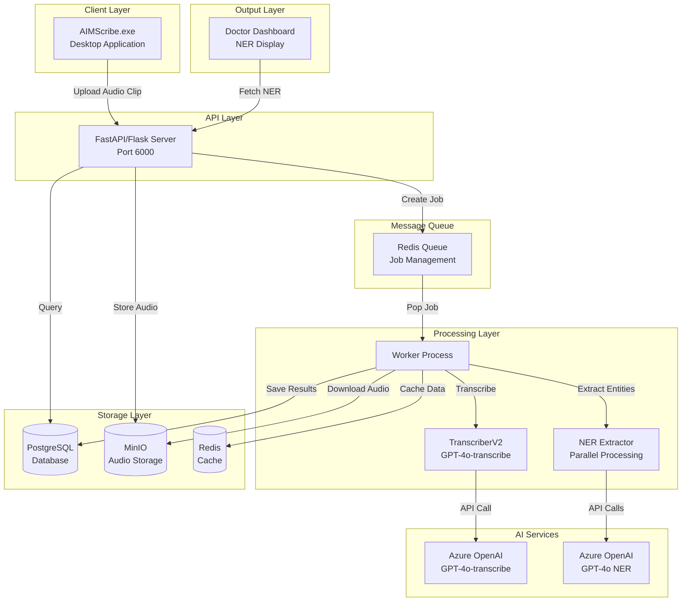
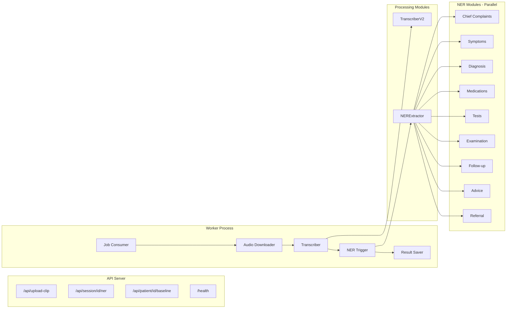
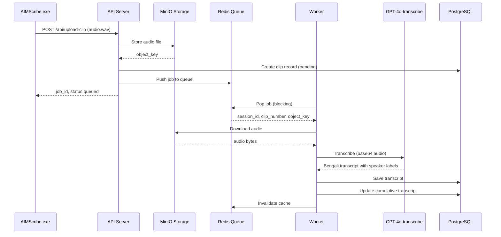
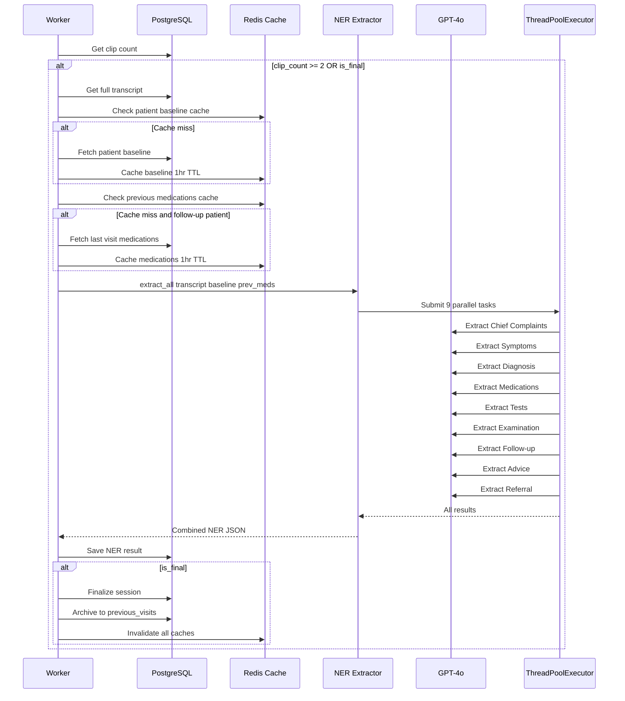
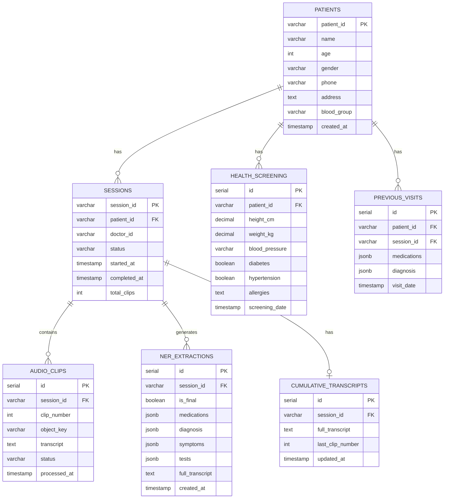
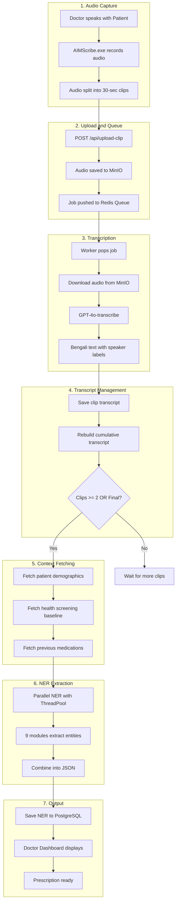
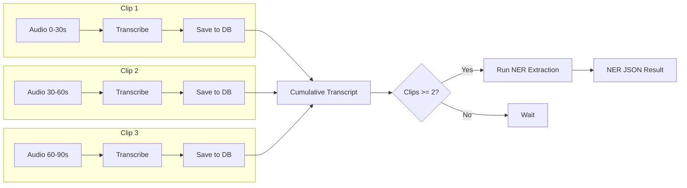

# AIMScribe AI Backend

<div align="center">

**Bengali Medical NER Extraction System for Doctor-Patient Conversations**

[](https://www.python.org/downloads/)
[](https://fastapi.tiangolo.com/)
[](https://azure.microsoft.com/en-us/products/ai-services/openai-service)
[](https://www.postgresql.org/)

</div>

---

## Table of Contents

- [Overview](#overview)
- [Key Features](#key-features)
- [System Architecture](#system-architecture)
- [Data Flow](#data-flow)
- [Technology Stack](#technology-stack)
- [Project Structure](#project-structure)
- [Prerequisites](#prerequisites)
- [Installation Guide (Windows)](#installation-guide-windows)
- [Configuration](#configuration)
- [Running the Project](#running-the-project)
- [API Endpoints](#api-endpoints)
- [Database Schema](#database-schema)
- [NER Extraction Modules](#ner-extraction-modules)
- [Troubleshooting](#troubleshooting)
- [Quick Command Reference](#quick-command-reference)

---

## Overview

AIMScribe Backend is the AI-powered core of the AIMScribe medical transcription system. It processes audio recordings from doctor-patient consultations and extracts structured medical data that can be used to auto-generate prescriptions.

### The Problem

Doctors in Bangladesh spend significant time manually writing prescriptions during patient consultations. This reduces the time available for actual patient care and can lead to:
- Illegible handwriting
- Missing information
- Delayed patient processing
- Doctor fatigue

### The Solution

AIMScribe listens to the doctor-patient conversation and automatically:
1. **Transcribes** the Bengali audio with speaker identification
2. **Extracts** medical entities (medications, diagnoses, symptoms, etc.)
3. **Generates** structured prescription data
4. **Displays** the information on a dashboard for doctor verification

---

## Key Features

| Feature | Description |
|---------|-------------|
| **Bengali Audio Transcription** | Uses GPT-4o-transcribe for accurate Bengali medical transcription |
| **Speaker Diarization** | Automatically labels [ডাক্তার], [রোগী], [রোগীর সাথী] |
| **Real-time Processing** | Processes audio clips as they arrive (streaming support) |
| **Parallel NER Extraction** | 9 extraction modules run concurrently for speed |
| **Chain-of-Thought Prompting** | Advanced reasoning for accurate entity extraction |
| **Few-Shot Learning** | Bengali medical examples for context-aware extraction |
| **Patient History Integration** | Fetches baseline data and previous medications |
| **Follow-up Support** | Handles "continue same medicine" scenarios |
| **Connection Pooling** | Optimized database connections for performance |
| **Redis Caching** | Reduces redundant database queries |

---

## System Architecture

### High-Level Architecture Diagram



### Component Architecture



### Transcription Sequence Diagram



### NER Extraction Sequence Diagram



### Database Entity Relationship Diagram



---

## Data Flow

### Complete System Flow Diagram



### Audio Clip Processing Pipeline



---

## Technology Stack

| Layer | Technology | Purpose |
|-------|------------|---------|
| **API Framework** | FastAPI / Flask | HTTP API endpoints |
| **AI - Transcription** | Azure OpenAI GPT-4o-transcribe | Bengali audio to text |
| **AI - NER** | Azure OpenAI GPT-5.2 | Entity extraction |
| **Database** | PostgreSQL 14+ | Structured data storage |
| **Cache & Queue** | Redis 7+ | Job queue and caching |
| **Object Storage** | MinIO | Audio file storage |
| **Parallelism** | ThreadPoolExecutor | Concurrent NER extraction |
| **ORM** | psycopg2 / asyncpg | Database access |

---

## Project Structure

```
aimscribe-backend/
│
├── .env                           # Environment configuration
├── docker-compose.yml             # Docker services
├── requirements.txt               # Python dependencies
├── README.md                      # This file
├── RUN_GUIDE.md                   # Quick start guide
│
├── Batch Scripts (Windows)
│   ├── install.bat                # Install dependencies
│   ├── start_services.bat         # Start Docker services
│   ├── stop_services.bat          # Stop Docker services
│   ├── run_setup.bat              # Initialize database
│   ├── run_tests.bat              # Run API tests
│   ├── run_server.bat             # Start API server
│   └── run_worker.bat             # Start worker
│
├── src/                           # Source code
│   ├── main.py                    # Flask API server
│   ├── main_fastapi.py            # FastAPI server (async)
│   ├── worker.py                  # Job processor
│   ├── worker_async.py            # Async job processor
│   ├── config.py                  # Configuration management
│   │
│   ├── processing/                # AI processing modules
│   │   ├── transcriber.py         # Whisper transcriber (legacy)
│   │   ├── transcriber_v2.py      # GPT-4o-transcribe
│   │   └── ner_extractor.py       # Parallel NER extraction
│   │
│   ├── database/                  # Database layer
│   │   ├── postgres.py            # Sync PostgreSQL
│   │   └── postgres_async.py      # Async PostgreSQL
│   │
│   ├── queue/                     # Message queue
│   │   ├── redis_client.py        # Sync Redis
│   │   └── redis_async.py         # Async Redis
│   │
│   ├── storage/                   # Object storage
│   │   └── minio_client.py        # MinIO client
│   │
│   └── prompts/                   # AI prompts
│       ├── agents/                # Agent system prompts
│       └── ner/                   # NER extraction prompts
│
├── scripts/                       # Setup scripts
│   ├── init_database.sql          # Database schema
│   └── setup.py                   # Setup wizard
│
└── tests/                         # Test files
    └── test_azure_apis.py         # API tests
```

---

## Prerequisites

### Required Software

| Software | Version | Download Link |
|----------|---------|---------------|
| Python | 3.10+ | https://www.python.org/downloads/ |
| Docker Desktop | Latest | https://www.docker.com/products/docker-desktop |
| Git | Latest | https://git-scm.com/downloads |

### Azure OpenAI Requirements

You need access to Azure OpenAI with the following deployments:

| Deployment | Model | Purpose |
|------------|-------|---------|
| gpt-4o-transcribe | gpt-4o-audio-preview | Bengali audio transcription |
| gpt-4o | gpt-5.2 | NER extraction |

### How to Get Azure OpenAI Credentials

1. Go to [Azure Portal](https://portal.azure.com)
2. Navigate to **Azure OpenAI** service
3. Create or select your resource
4. Go to **Keys and Endpoint** in the left sidebar
5. Copy **KEY 1** and **Endpoint**
6. Go to **Azure OpenAI Studio** → **Deployments**
7. Note your deployment names

---

## Installation Guide (Windows)

### Step 1: Navigate to the Project

```powershell
cd "D:\AIMS LAB REVIEW PAPER\pyaudio secondary version\aimscribe-backend"
```

### Step 2: Install Python Dependencies

**Option A: Using batch script (Recommended)**
```
Double-click: install.bat
```

**Option B: Manual installation**
```powershell
# Create virtual environment
python -m venv venv

# Activate virtual environment
.\venv\Scripts\activate

# Upgrade pip
python -m pip install --upgrade pip

# Install dependencies
pip install -r requirements.txt
pip install python-dotenv
```

### Step 3: Start Docker Services

**Make sure Docker Desktop is running first!**

**Option A: Using batch script (Recommended)**
```
Double-click: start_services.bat
```

**Option B: Using command line**
```powershell
docker-compose up -d
```

**Verify services are running:**
```powershell
docker-compose ps
```

Expected output:
```
NAME                  STATUS
aimscribe-postgres    running (healthy)
aimscribe-redis       running (healthy)
aimscribe-minio       running (healthy)
```

### Step 4: Configure Environment Variables

Edit the `.env` file with your credentials:

```powershell
notepad .env
```

**Update these values:**
```env


### Step 5: Initialize Database

**Option A: Using batch script (Recommended)**
```
Double-click: run_setup.bat
```

**Option B: Using command line**
```powershell
.\venv\Scripts\activate
python scripts/setup.py
```

### Step 6: Test API Connections

**Option A: Using batch script (Recommended)**
```
Double-click: run_tests.bat
```

**Option B: Using command line**
```powershell
.\venv\Scripts\activate
python tests/test_azure_apis.py
```

---

## Running the Project

### Quick Start (Two Terminals Required)

You need to run **TWO** processes simultaneously:

#### Terminal 1: API Server

```
Double-click: run_server.bat
```

Or manually:
```powershell
.\venv\Scripts\activate
python src/main.py
```

Expected output:
```
2024-XX-XX 10:00:00 - INFO - AIMScribe AI Backend starting...
2024-XX-XX 10:00:00 - INFO - Server running on http://0.0.0.0:6000
```

#### Terminal 2: Worker

```
Double-click: run_worker.bat
```

Or manually:
```powershell
.\venv\Scripts\activate
python src/worker.py
```

Expected output:
```
2024-XX-XX 10:00:00 - WORKER - INFO - Initializing AIMScribe Worker...
2024-XX-XX 10:00:00 - WORKER - INFO - TranscriberV2 initialized with model: gpt-4o-transcribe
2024-XX-XX 10:00:00 - WORKER - INFO - Worker started. Listening on aimscribe:queue:transcription...
```

### Verify System is Running

```powershell
curl http://localhost:6000/health
```

Expected response:
```json
{"status": "healthy", "version": "1.0.0"}
```

### Service URLs

| Service | URL | Credentials |
|---------|-----|-------------|
| API Server | http://localhost:6000 | - |
| MinIO Console | http://localhost:9001 | aimscribe / aimscribe123 |
| PostgreSQL | localhost:5432 | aimscribe_user / aimscribe123 |
| Redis | localhost:6379 | - |

---

## API Endpoints

### Health Check

```http
GET /health

Response:
{
    "status": "healthy",
    "version": "1.0.0"
}
```

### Upload Audio Clip

```http
POST /api/upload-clip
Content-Type: multipart/form-data

Parameters:
- session_id: string (required)
- clip_number: integer (required)
- audio: file (required, .wav format)
- is_final: boolean (optional, default: false)

Response:
{
    "job_id": "uuid",
    "session_id": "string",
    "clip_number": 1,
    "status": "queued"
}
```

### Get NER Results

```http
GET /api/session/{session_id}/ner

Response:
{
    "session_id": "string",
    "is_final": true,
    "chief_complaints": [...],
    "symptoms": [...],
    "diagnosis": [...],
    "medications": [...],
    "tests": [...],
    "examination": {...},
    "follow_up": {...},
    "advice": [...],
    "referral": [...]
}
```

### Get Patient Baseline

```http
GET /api/patient/{patient_id}/baseline

Response:
{
    "patient_id": "string",
    "name": "রহিম উদ্দিন",
    "age": 45,
    "gender": "Male",
    "health_screening": {
        "blood_pressure": "140/90",
        "diabetes": true,
        "hypertension": true
    }
}
```

---

## NER Extraction Modules

| Module | Output Type | Description |
|--------|-------------|-------------|
| Chief Complaints | Array | Primary reason for visit |
| Symptoms | Array | Patient-reported symptoms with duration |
| Diagnosis | Array | Doctor's diagnosis (provisional/confirmed) |
| Medications | Array | Prescribed medicines with dosage |
| Tests | Array | Ordered laboratory/imaging tests |
| Examination | Object | Physical examination findings |
| Follow-up | Object | Next appointment details |
| Advice | Array | Lifestyle/dietary recommendations |
| Referral | Array | Specialist referrals |

### Sample NER Output

```json
{
    "chief_complaints": [
        {"complaint": "জ্বর", "duration": "৩ দিন"}
    ],
    "symptoms": [
        {"symptom": "মাথা ব্যথা", "severity": "moderate", "duration": "৩ দিন"},
        {"symptom": "শরীর ব্যথা", "severity": "mild"}
    ],
    "diagnosis": [
        {"condition": "Viral Fever", "type": "provisional"}
    ],
    "medications": [
        {
            "name": "Paracetamol",
            "dose": "500mg",
            "frequency": "৩ বার",
            "duration": "৫ দিন",
            "instructions": "খাবার পরে"
        }
    ],
    "tests": [
        {"test": "CBC", "urgency": "routine"}
    ],
    "follow_up": {
        "days": 5,
        "condition": "জ্বর না কমলে"
    },
    "advice": [
        "প্রচুর পানি পান করুন",
        "বিশ্রাম নিন"
    ]
}
```

---

## Troubleshooting

### Docker Issues

**Docker services not starting:**
```powershell
# Check Docker is running
docker info

# Restart Docker Desktop, then retry
docker-compose up -d
```

**Port already in use:**
```powershell
# Check what's using port 5432
netstat -ano | findstr :5432
```

### Database Issues

**Connection refused:**
```powershell
# Check PostgreSQL container
docker logs aimscribe-postgres

# Restart container
docker-compose restart postgres
```

### Azure API Issues

**Authentication error:**
1. Verify API key in `.env` file
2. Check the key is not expired
3. Ensure no extra spaces in the key

**Model not found:**
1. Verify deployment name in Azure OpenAI Studio
2. Ensure the deployment is active

### Redis Issues

**Connection refused:**
```powershell
docker exec aimscribe-redis redis-cli ping
```

---

## Quick Command Reference

```powershell
# Activate virtual environment
.\venv\Scripts\activate

# Start all Docker services
docker-compose up -d

# Stop all Docker services
docker-compose down

# View Docker logs
docker-compose logs -f

# Run API tests
python tests/test_azure_apis.py

# Start API server
python src/main.py

# Start worker
python src/worker.py

# Check API health
curl http://localhost:6000/health
```

---

## Performance Optimizations

| Optimization | Improvement | Implementation |
|--------------|-------------|----------------|
| Connection Pooling | 12x faster DB access | ThreadedConnectionPool (min=2, max=10) |
| Parallel NER | 4-5x faster extraction | ThreadPoolExecutor (9 workers) |
| Redis Caching | Eliminates repeated queries | TTL-based caching (1 hour) |
| Async I/O | Non-blocking operations | FastAPI + asyncpg |

---

## License

This project is proprietary software developed for AIMS Lab.

---

## Support

For issues and support:
1. Check the [Troubleshooting](#troubleshooting) section
2. Review Docker logs for errors
3. Verify all environment variables are set correctly

---

**Developed by AIMS Lab Research Team**

© 2026 AIMScribe
